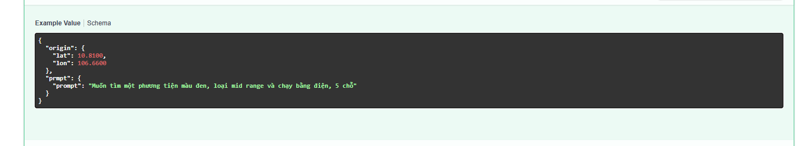
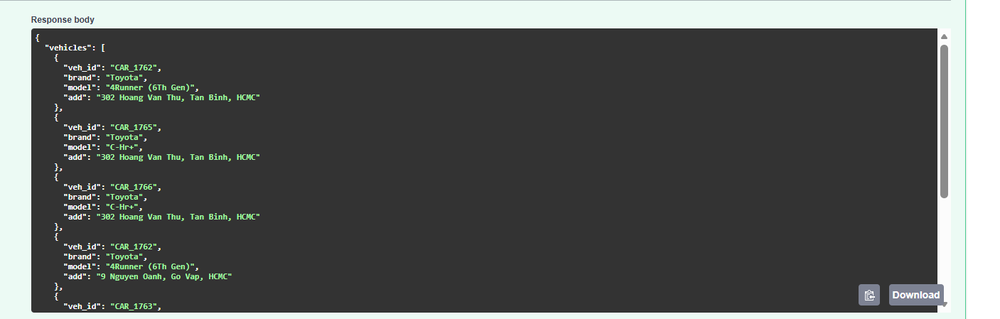

# Model tìm kiếm xe hợp lý với yêu cầu của user

## Cách chạy
- Tải các thư viện cần thiết trong file requirements
- Chạy lệnh uvicorn main:app --reload
- Mở http://127.0.0.1:8000/docs

## In and out
- Ví dụ đầu vào 

- Ví dụ đầu ra

Đầu vào gồm Coordinates vị trị hiện tại của user và
prompt user gửi để xử lý.

Đầu ra là list các id, tên hãng, tên mẫu, và shop đang cho thuê

## Phần khác
Yêu cầu prompt: Đầy đủ các attribute, loại xe {xe máy, ô tô}, loại fuel, màu sắc, số chỗ ngồi, phân khúc giá.

Khi xử lý xong phần prompt thì sẽ có một dataframe gồm các id phương tiện phù hợp nhất với yêu cầu khách hàng, và đối chứng id với bên list thuê xe
xét vị trí hiện tại của user và vị trí của bên cho thuê, nếu khoảng cách hơn 50 km thì id xe đó bị xóa khỏi list.
